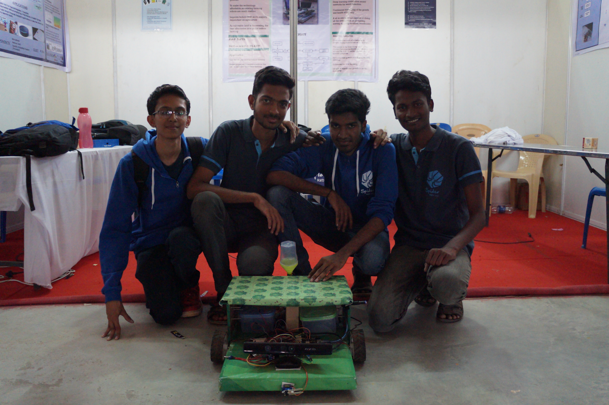

# agriX
                                                                                                              
A differential drive robot that maps an indoor area and plans paths for efficient navigation in indoor agricultural fields.

## Video Link :
https://www.youtube.com/watch?v=_kQo_sd1_AM

## Hardware Requirements :
  – Two geared DC motors with integrated encoder 
  – Xbox kinect 360 
  – Lenovo Zuk2/ Android 
  – Arduino uno 320p                                                                                                          
  – 6800mAh 3S LiPo battery (and balance charger)
  – Wood planks for chassis base
  – L shaped metal brackets                                                                                                
  – Nuts and Bolts                                                                                                          
  – wires and cables                                                                                        
 
## Software Requirements :                                                                                                  
  – Ubuntu 16.04 and ROS kinetic                                                                                        
  – OpenCV                                                                                                                  
  – Tensorflow                                                                                                              
  – Android Studio
  
## Procedure:

1. Clone the github repo: $ git clone address/to/my/repo
2. Install the following ros packages: navigation, freenect, gmapping
3. Change the wheel diameter, track width and other required parameters in robot_specs.h
4. Edit the robot_config.launch and change static_transform_publisher args for tranformation of Kinect frame to Base link
5. If you are not using an android phone for imu data, comment out the lines related to imu in robot_config.launch
6. If you have not created urdf model for your robot, remove the urdf inclusion in driver.launch, slam.launch,
   move_base.launch, and laser_scan.launch
7. To drive the bot around : $ roslaunch agriX driver.launch
8. To try laser scanner, SLAM gmapping, and navigation, roslaunch laser_scan.launch, slam.launch, and
move_base.launch respectively
9. Play around with the parameters in the launch files to get your required results

## Team Members:

1. Vibashan VS  
2. Bharath Kumar
3. Senthur Raj
4. Vivek DC
5. Rajiv Ramachandran
